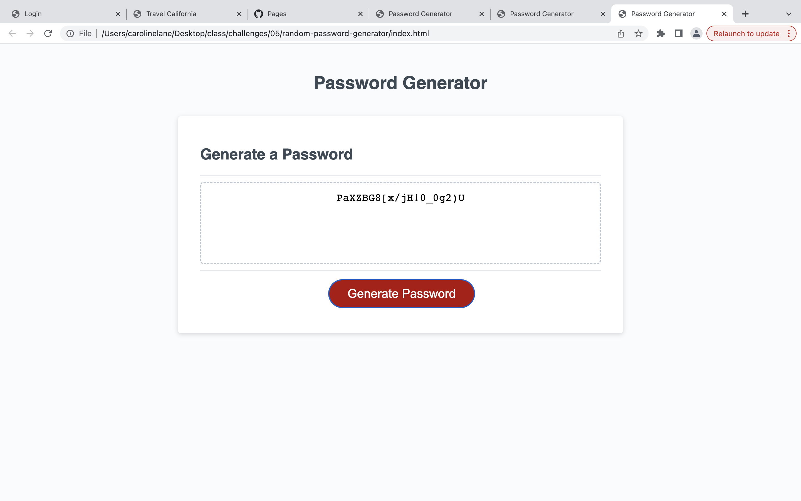
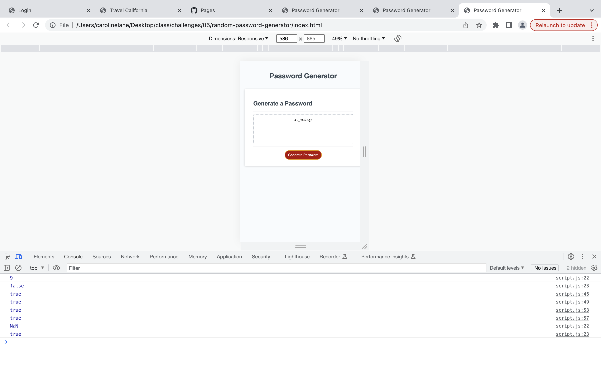
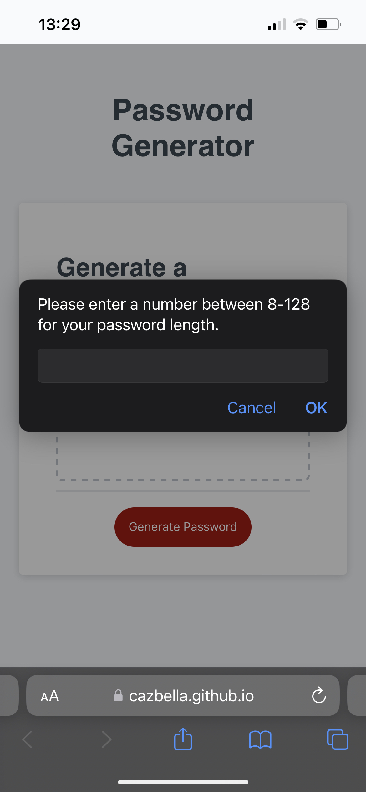

# random-password-generator
An app to generate random passwords.

This project is designed to solve the challenges set out in the Module 5 assignment. It primarily uses JavaScript.  

## Description

This project is an application that generates a password for the user upon request based upon user preferences. 

Please find a screenshot below of the landing area;

The image shows the first prompt box the user encounters upon clicking the 'generate password' button. 

This project aims to show my current skills in using JavaScript that we have learned on the course so far, solving the requirements of the Module 05 Challenge in the EdX Frontend Web Development Bootcamp. 

My biggest challenge was understanding all the parts of the code that are present and whet each part does. 

I have completed a JavaScript course previously, but I had not encointered some of the syntax required. 

## Usage

Please find a link to the live application here; 

https://github.com/cazbella/random-password-generator/settings/pages

Please click the 'Generate Password' button to begin.

1. A prompt should appear asking the user to "Please enter a number between 8-128 for your password length."

2. When the user enters a number of the required length, the process of selecting the character types the user requires in their password begins. If the user enters letters the following message appears - "Please enter a number between 8 and 128 characters. Please start again."
If the user enters a number of the wrong size, the following message appears -
"Incorrect number - Please enter a number between 8-128. Please start again." 

3. The user is then guided through a series of confirms where they must click "cancel" or "OK" to select the type of characters that they would like to include in their password. If the user does not select any character types (i.e. clicks cancel on each confirm box), they are shown an alert which states - "You must select at least one character type for your password."

4. Once all the choices have been made by the user, a password of the desired length and characters should appear in the box, as shown below; 

If the user clicks the button at this point the process begins again. 

__The Console__
_______________
It is a requirement that there are no errors in the console.

Please open the HTML file in the browser and inspect the page. Then please view the console. You should see the following based on the choices made using the prompt/confirm boxes; 

As you can see, there are no errors in the console. 

__A Note about Pseudocode__
_____________________________

The JavaScript file that logs this code contains lots of comments. The tutor was asked if this was good practice and the advice given was that as I am new to web development, there should be lots of comments at this stage. Hopefully the comments and the commits explain the process I followed to complete the assignment. I have also made notes here to help me remember the process and what the syntax means. 

__A Note about Function__
_________________________

I have chosen not to recursively recall the function on line 31. I feel that for the user prompts without a break can get confusing and can feel like you're in an alert spiral. Once they are told about their error they have to re-start the process. The user hasn't gone too far through the process at this point so hopefully wouldn't feel too frustrated. The alert informs them of the required action. 

__A Note about Responsiveness__
___________________________
The assignment criteria states that the application should be responsive. I have tested this using chrome inspect and also on mobile. Please find a screenshot below showing the page on my phone; 

The application appears to be responsive, although I have not personally written code to ensure this is the case. 

## References

I completed the Northcoders pre-work JavaScript module, so I had a foundation knowledge of some of the concepts covered. I have used google a lot this week, including Stack Overflow, W3 schools and MDN web docs. We also used the 1:1 tutor session this week to look at assignment 5. 

## Contributing

I would very much appreciate some feedback on the methods I have used to achieve the task. Is this the most concise code I could have used? I would also like to know if the readme layout and content was appropriate for the task if possible please. 

## License

[MIT](https://choosealicense.com/licenses/mit/)